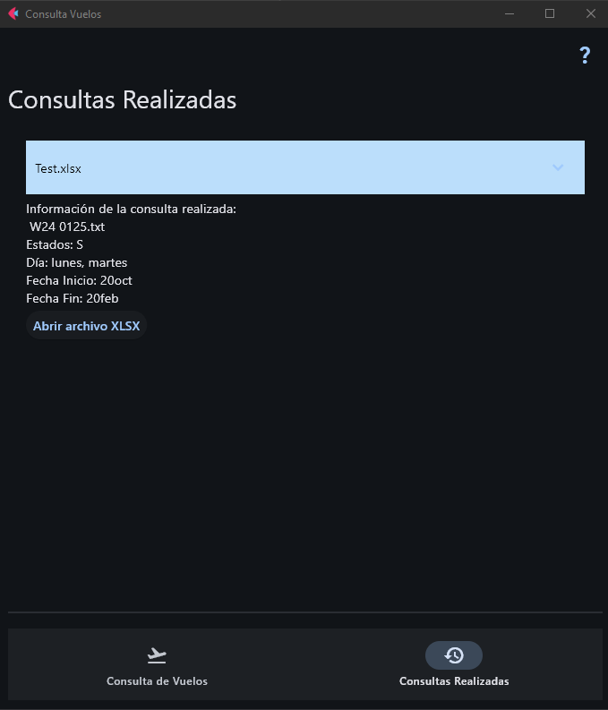

# Airport Traffic Analyzer

This application is used to calculate the peak day and week of an airport's traffic as well as to identify the countries with the most passengers. It processes a text file with a fixed structure where each line represents a flight record. **Note:** The program and code are written in Spanish.

## File Format

Each line of the input `.txt` file must follow a fixed-width format. For example, a typical line looks like this:

### Example Flight Record

"W24","LPA","S","IB 1450      0000 0030000 28FEB28FEB 000ZZZ 0    ZZZZZZ   K 1 A                                     ","                           ","00:00","IB"," 1450","28/02/24","28/102/24","0030000","000","ZZZ","0","ZZZ","ZZZ"," ","K","1","A"

The example above is representative of a flight record line in the expected text file. Each field in the line is fixed in width, and only specific slices are used in the application, as detailed in the next section.

Even though the complete structure of the file includes many fields, the Python code only extracts and stores specific elements into the database. Below is an explanation of each element that is added by the Python code.

## Extracted Elements

The following variables are obtained from specific slices of each flight record line:

- **est** (`linea[1]`):  
  Represents a code related to the flight status or the airport’s station identifier.  
  _Example source value:_ a single character code indicating the current state.

- **apto** (`linea[7:10]`):  
  Indicates the airport or terminal code associated with the flight.  
  _Example source value:_ a three-character code representing the airport.

- **estad** (`linea[13]`):  
  Contains the flight’s operational status.  
  _Example source value:_ a status indicator (e.g., scheduled, delayed).

- **comp** (`linea[17:20]`):  
  Represents the airline company code.  
  _Example source value:_ a three-character airline identifier.

- **num** (`linea[20:24]`):  
  Contains the flight number.  
  _Example source value:_ a numeric or alphanumeric flight number.

- **h_llegada** (`linea[26:30]`):  
  Indicates the scheduled arrival time of the flight.  
  _Example source value:_ time in a HH:MM or similar format.

- **h_salida** (`linea[30:34]`):  
  Indicates the scheduled departure time of the flight.  
  _Example source value:_ time in a HH:MM or similar format.

- **lun** (`linea[35]`):  
  A flag indicating if the flight operates on **Monday**.  
  _Example source value:_ typically a character or digit flag (e.g., "1" for yes).

- **mart** (`linea[36]`):  
  A flag indicating if the flight operates on **Tuesday**.

- **mierc** (`linea[37]`):  
  A flag indicating if the flight operates on **Wednesday**.

- **juev** (`linea[38]`):  
  A flag indicating if the flight operates on **Thursday**.

- **vier** (`linea[39]`):  
  A flag indicating if the flight operates on **Friday**.

- **sab** (`linea[40]`):  
  A flag indicating if the flight operates on **Saturday**.

- **dom** (`linea[41]`):  
  A flag indicating if the flight operates on **Sunday**.

- **ini** (`linea[43:48]`):  
  The start date of the flight schedule.  
  _Example source value:_ a date in a specific format (e.g., DD/MMY).

- **fin** (`linea[48:53]`):  
  The end date of the flight schedule.  
  _Example source value:_ a date similar to the start date format.

- **codigo** (`linea[66:69]`):  
  A code that may represent the destination, the country, or another categorization used later for statistics.  
  _Example source value:_ a three-character code.

- **n_pasajeros** (`linea[204:207]`):  
  The number of passengers on the flight.  
  _Example source value:_ a numeric value representing passenger count.

- **avion** (`linea[210:213]`):  
  Identifies the aircraft model or registration number.  
  _Example source value:_ a three-character code referring to the airplane.

## Dependencies

The following external libraries are required for this application, as they are not included in the default Python installation:

- **pandas**:  
  Used for data manipulation and analysis. It helps convert and manage the extracted data into DataFrame structures for further processing and visualization.

- **pycountry**:  
  Provides standardized country information and is used to map country codes to their corresponding country names or other related data.

- **airportsdata**:  
  This library loads airport data that is used to enhance the analysis, such as cross-referencing airport codes and names.

- **flet**:  
  A framework for building interactive web, mobile, and desktop applications in Python. It is used to create the graphical user interface (GUI) of this application.

## How It Works

1. **Input File Processing:**  
   The application reads the input `.txt` file, expecting each line to conform to the fixed-width format described above.

2. **Data Extraction:**  
   The Python code extracts the specified slices from each line and assigns them to variables. These variables are then used to build the database entries for further analysis.

3. **Analysis:**  
   Once the data is loaded, the application processes the information to calculate:
   - The peak day and week of airport traffic.
   - The countries (or coded entities) with the highest number of passengers.

## Running the Application

1. **Prepare the Input File:**  
   Ensure your `.txt` file is structured correctly and is placed in the expected directory.

2. **Install Dependencies:**  
   Make sure to install the external dependencies before running the application. You can install them using `pip`:
   ```bash
   pip install pandas pycountry airportsdata flet
3. **Execute the Code:**  
   Run the Python script (which is in Spanish) to process the file and perform the analysis.  
   ```bash
   python main.py

## Example
1. **Flights Query**

  

2. **Queries Made**

  
   
